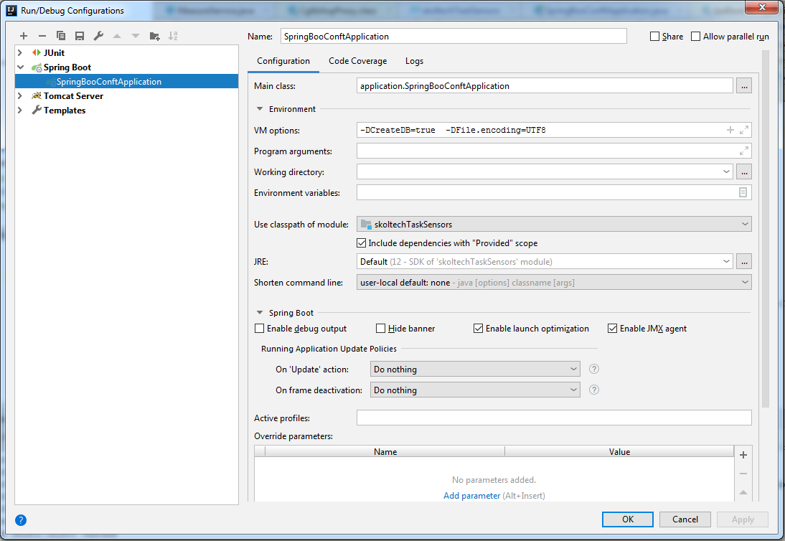

# ApiTest task in SkolTech

Задание:
/files/Java Developer_v3__13_01_2020.docx (Лежит в корне репозитория)

#Инструкция по запуску

## Вам потребуется:

1) Maven 3.3.9 or later. Или встроенный в Intellij Idea.
2) БД PostgreSQL (Версия 9 и выше.)

## БД:

1) Создать пользователя, **unit_dev** (super user)
2) Создать БД с названием **skoltech_task_sensors**
3) Развернуть в неё backup files/skoltech_task_sensors.backup
4) Если на шаге 3 возникли сложности - можно накатить sql из файла \src\main\resources\db.sql

## Подготовка данных

1) Запустить генератор данных
**python generate_sensor_data.py -t 1514764800 -p 10 -N 2 -n 3 -s 42**

    В корне появится файл **data.json**

2) Указать полный путь до файла **data.json** в файле application.properties

    **path.to.json.data**=**fullPathTo_data.json**

## Java

1) Произвести сборку проекта **mvn clean install**
2) Рекомендуется поставить Application context=/ и поставить порт 8080
3) Добавить артефакт для сборки.
4) Добавить параметры 
    -DCreateDB=true (Заполнение БД из файла data.json)
    -DFile.encoding=UTF8

​

# Доступное api

#### 1) /api/save
http://localhost:8080/api/save

POST
Тело запроса: 
[
	{
		"objectId": 1,
		"sensorId": 0,
		"value": -40.0,
		"time": 1514764800
	},
	{
		"objectId": 0,
		"sensorId": 0,
		"value": -40.0,
		"time": 1514764800
	},
	{
		"objectId": 1,
		"sensorId": 0,
		"value": -40.0,
		"time": 1514764801
	}
]

Пример ответа:
{
    "message": "Записи успешно добавлены",
    "id": 0,
    "success": true
}

#### 2) /api/history

http://localhost:8080/api/history?id=0
from, to - необязательные параметры
GET

Пример ответа:
[
	{
		"objectId": 1,
		"sensorId": 0,
		"value": -40.0,
		"time": 1514764800
	},
	{
		"objectId": 0,
		"sensorId": 0,
		"value": -40.0,
		"time": 1514764800
	},
	{
		"objectId": 1,
		"sensorId": 0,
		"value": -40.0,
		"time": 1514764801
	}
]

#### 3) /api/latest

http://localhost:8080/api/latest?id=0
GET

Пример ответа:
[
	{
		"objectId": 0,
		"sensorId": 0,
		"value": -40.0,
		"time": 1514764809000
	},
	{
		"objectId": 0,
		"sensorId": 1,
		"value": -29.0,
		"time": 1514764809000
	},
	{
		"objectId": 0,
		"sensorId": 2,
		"value": -2.0,
		"time": 1514764809000
	}
]

#### 4) /api/avg

http://localhost:8080/api/avg
GET

Пример ответа:
[
	{
		"id": 0,
		"value": -29.133333333333334
	},
	{
		"id": 1,
		"value": -27.075
	}
]

#### 5) allMeasures

http://localhost:8080/api/allMeasures
GET

